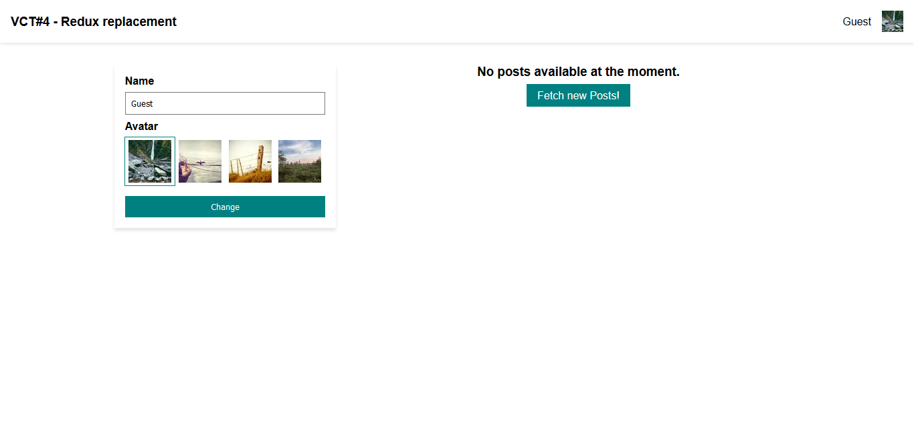

# Vọc cùng Thành #4: Redux replacement

## Giới thiệu

Đây là repo demo cho bài viết [Vọc cùng Thành #4: Redux replacement]().



## Cài đặt

Bạn cần có Git và Node để cài đặt và chạy ứng dụng này.

```bash
# clone repo về máy
git clone https://github.com/EGANY-Team/vct-4-redux-replacement

# cài đặt package
cd vct-4-redux-replacement
npm install

# chạy dev http://localhost:1234
npm start

# build
npm run build
```
